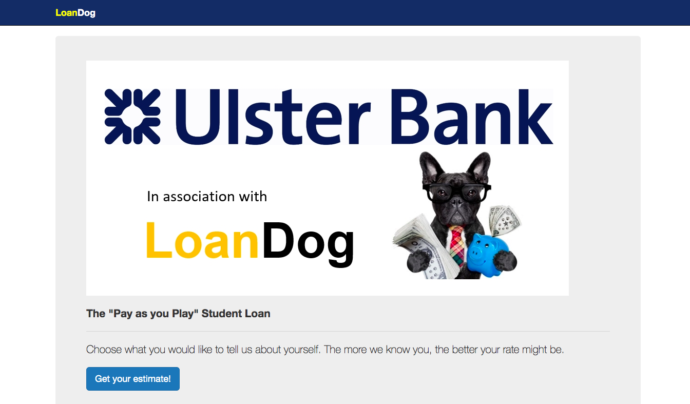
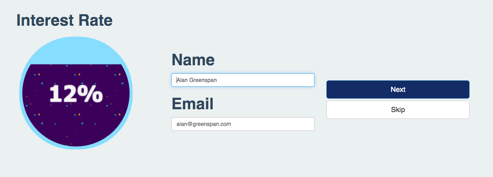
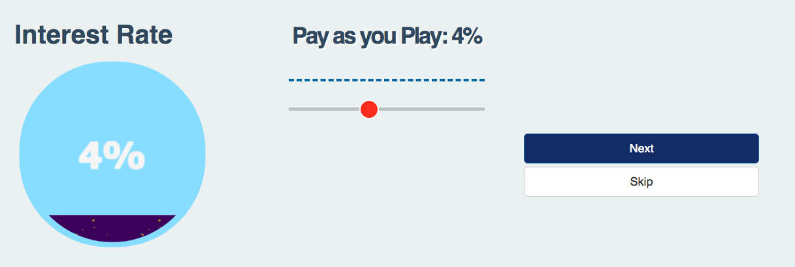
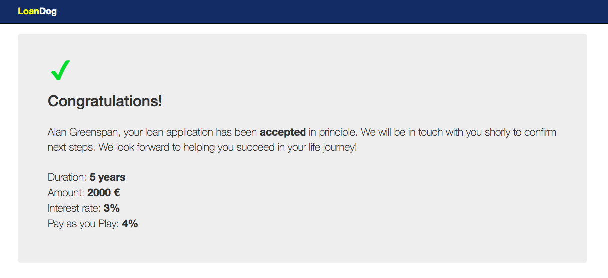

# LoanDog AI

LoanDog AI creates a Trust Score for Students using their social interactions (Twitter, LinkedIn, etc.) and banking transactions to build a digital footprint that enables Banks to risk assess them for Student Loans. 

[LoanDog AI at Ulster Bank #Hackathon 2019 in Dogpatch Labs](https://docs.google.com/presentation/d/1nRPshC6eZifZLDjAU3t1etM3w6xTgNrfittmi31ttGc/edit#slide=id.g5109ce94bf_0_0)

[LoanDog AI on Twitter](https://twitter.com/loandogai)

---






## Technologies

* [Flask](http://flask.pocoo.org/)
* [Bootstrap](https://getbootstrap.com/)
* [D3](https://d3js.org/)
* [Docker](https://www.docker.com/)
* [Tweepy](https://www.tweepy.org/)

## Deployment

### Docker

Build image with Docker Compose using the Makefile's command:
```
$ make build
```

Run the image to start the container:
```
$ make run
```

## Contributors

* [David Azcona](https://github.com/dazcona)
* [Enric Moreu](https://github.com/enric1994)
* [Juan Jose Nieto](https://github.com/juanjo3ns)
* [Pol Caselles](https://github.com/pcaselles)
* Miriam O'Flynn